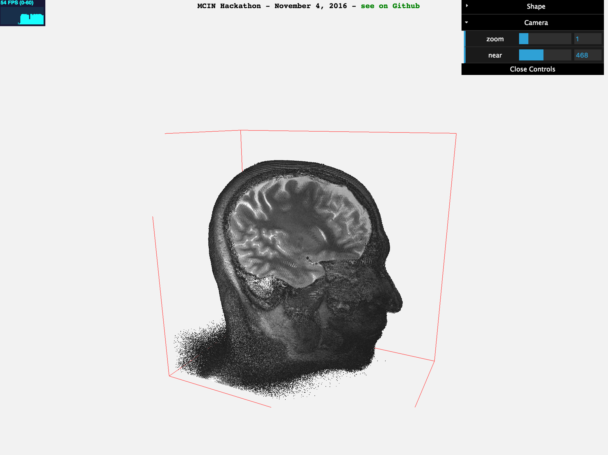

# MCIN lab Hackathon project
3D visualizer for neuro imaging data (minc files). It shows the whole dataset as a point cloud that we can cut into using arbitrary planes.  

The strange white stripes are due to tessellation using GL_POINTS, especially because the points are not totally contiguous, there is a bit of space in between.
